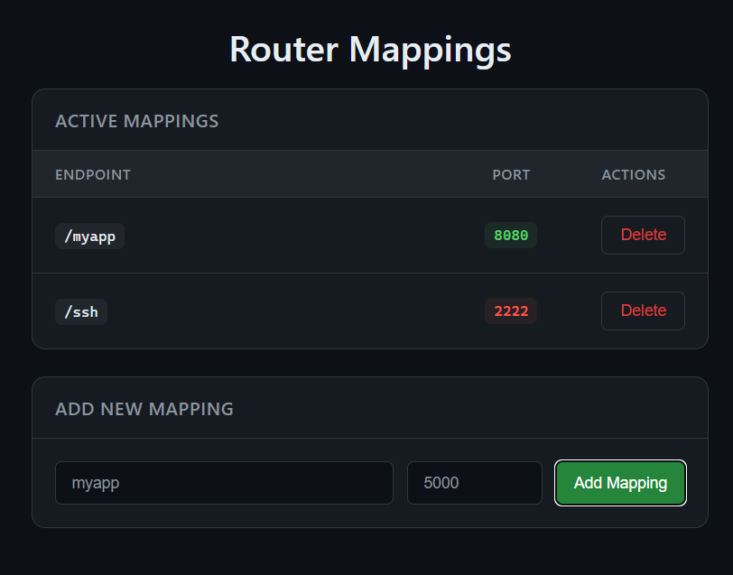

maps endpoints to localhost ports for easily hosting local services

- `https://mydomain.com/myapp` => `http://localhost:8080`
- `https://mydomain.com/ssh` => `http://localhost:2222`

  

### Usecase

- imagine you have a cloudflare domain `example.com`
- and you want to run bunch of apps/services on this domain
  - `myapp.example.com` => `localhost:8080`
  - `ssh.example.com` => `localhost:2222`
- you configure cloudflare tunnel to do this
- but you often change services you run, subdomain names, ports etc.
- each time you have to reconfigure/rerun cloudflare tunnel
- now imagine a nice GUI where you can easily change what services you run on which port
- this tool is exactly that, it looks like this:
  - `example.com/myapp` => `localhost:8080`
  - `example.com/ssh` => `localhost:2222`
- instead of tunneling each cloudflare `subdomain` => `localhost:<port>` everytime
- you route `example.com` => `localhost:3003` once
- and change what services run on which port from GUI on `localhost:3004`
- `localhost:3003/myapp` will route your requests to `/myapp`'s port `8080`
